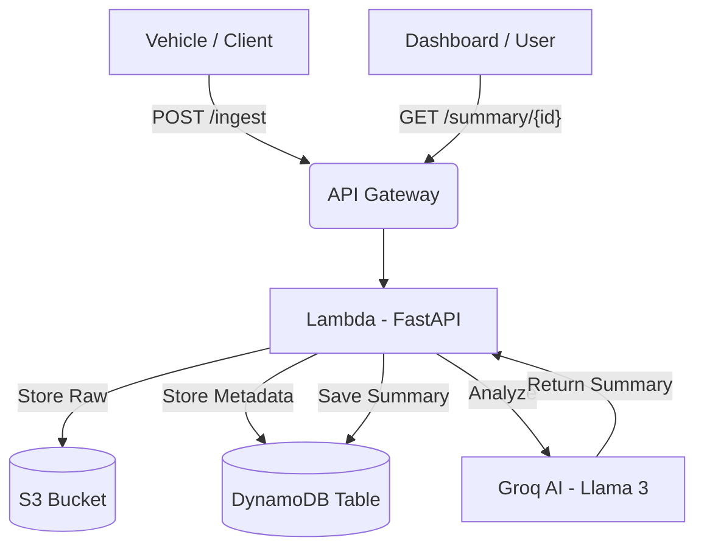

<div align="center">

# 🚗 AutoInsight AI Telemetry

### Serverless AI-powered vehicle telemetry analysis and diagnostics

[](https://www.python.org/)
[](https://fastapi.tiangolo.com/)
[](https://aws.amazon.com/cdk/)
[](https://groq.com/)
[](https://github.com/features/actions)

Built to ingest real-time vehicle telemetry, store data securely on AWS, and generate AI-driven diagnostic summaries using Groq.

[Quick Start](#-quick-start) • [Architecture](#-architecture) • [Features](#-highlights) • [Docker](#-docker--containerization) • [Project Structure](#-project-structure)

</div>

---

## ✨ Highlights

| Capability | Description |
| --- | --- |
| **Serverless Ingestion** | REST API via FastAPI + AWS Lambda (Mangum) |
| **AI Diagnostics** | Automated severity assessment via Groq Llama 3.3 |
| **Secure Storage** | Raw JSON in versioned S3; structured metadata in DynamoDB |
| **Infrastructure as Code** | Fully automated resource provisioning with AWS CDK |
| **Fully Tested** | 85%+ code coverage using Pytest and Moto mocks |
| **CI/CD Ready** | GitHub Actions for automated testing and deployment |

---

## 🏗️ Architecture



1. **Ingest** → REST API receives telemetry and saves raw JSON to S3.
2. **Analyze** → Groq's Llama 3 assesses fault codes and metrics for severity.
3. **Persist** → AI-generated summaries and metadata are stored in DynamoDB.
4. **Retrieve** → Low-latency retrieval of vehicle diagnostics by ID.

---

## 🚀 Quick Start

### Prerequisites

- **Python 3.12+**
- **Node.js 20+** (for AWS CDK)
- **Docker** (for containerized deployment)
- **AWS CLI** configured with a Free Tier account

### 1) Setup

```bash
git clone https://github.com/nagasaicharanh/AutoInsight-AI.git
cd AutoInsight-AI
python -m venv .venv
```

Activate env:

- **Windows (PowerShell):** `.venv\Scripts\Activate.ps1`
- **macOS/Linux:** `source .venv/bin/activate`

Install dependencies:

```bash
pip install -r requirements.txt
```

### 2) Configure `.env`

Copy the example environment file and fill in your credentials:

```bash
cp .env.example .env
```

| Variable | Requirement | Description |
| --- | --- | --- |
| `GROQ_API_KEY` | **Required** | API key for Llama 3.3 inference via [Groq](https://console.groq.com/) |
| `AWS_ACCESS_KEY_ID` | **Required** | AWS access key for local S3/DynamoDB access |
| `AWS_SECRET_ACCESS_KEY` | **Required** | AWS secret key for local S3/DynamoDB access |
| `AWS_REGION` | Optional | AWS region (defaults to `us-east-1`) |

### 3) Run Locally

```bash
export PYTHONPATH=$PYTHONPATH:.
uvicorn app.main:app --reload
```

### 4) Run Tests

We use `pytest` with `moto` to mock AWS services.

```bash
export PYTHONPATH=$PYTHONPATH:.
pytest tests/ -v --cov=app --cov-report=term-missing
```

### 5) Deploy to AWS

```bash
cd infrastructure
npm install -g aws-cdk
pip install -r requirements.txt
cdk bootstrap
cdk deploy
```

---

## 🐳 Docker & Containerization

The application is containerized for **AWS Lambda** using the official Python 3.12 base image.

### Build and Test Locally
```bash
# Build
docker build -t autoinsight-lambda .

# Run via Lambda RIE
docker run -p 9000:8080 autoinsight-lambda

# Invoke
curl -X POST "http://localhost:9000/2015-03-31/functions/function/invocations" \
     -d '{"resource": "/ingest", "httpMethod": "POST", "body": "{\"vehicle_id\": \"v123\", \"timestamp\": \"2026-05-15T10:00:00Z\", \"fault_codes\": [], \"speed_kmh\": 0, \"engine_temp_celsius\": 20, \"mileage_km\": 100}"}'
```

---

## 💬 Example Payloads

### POST `/ingest`
**Request:**
```json
{
  "vehicle_id": "v123",
  "timestamp": "2026-05-15T10:00:00Z",
  "fault_codes": ["P0101", "P0420"],
  "speed_kmh": 65.5,
  "engine_temp_celsius": 98.2,
  "mileage_km": 150230
}
```

### GET `/summary/{vehicle_id}`
**Response:**
```json
{
  "vehicle_id": "v123",
  "summary": "Engine is running slightly hot (98.2°C). Fault codes P0101 (MAF) and P0420 (Catalyst) detected.",
  "severity": "MEDIUM"
}
```

---

## ⚙️ CI/CD (GitHub Actions)

The included `.github/workflows/deploy.yml` automates testing and deployment. To enable it, add the following **GitHub Secrets** to your repository:

- `AWS_ACCESS_KEY_ID`
- `AWS_SECRET_ACCESS_KEY`
- `GROQ_API_KEY`

---

## 📁 Project Structure

```text
AutoInsight-AI/
├── app/
│   ├── main.py          # FastAPI app & Lambda handler
│   ├── models.py        # Pydantic schemas
│   └── services/        # Logic layer (AI/Storage)
├── tests/               # Pytest suite with Moto
├── infrastructure/      # AWS CDK (Infrastructure-as-Code)
├── .github/workflows/   # CI/CD pipelines
├── Dockerfile           # Lambda container image
├── .env.example         # Environment template
└── requirements.txt     # Python dependencies
```

---

## 📜 License
MIT
